# Jenkins Mastery 🚀
**CI/CD Automation · Pipeline Engineering · Build Management · Configuration**

A hands-on learning repository documenting my journey to master Jenkins —
covering core concepts, pipeline automation, and CI/CD best practices through
practical labs and real configurations.

---

> **Repository Note**
>
> The labs in this repository are hands-on exercises designed to simulate
> real-world Jenkins workflows. Each section focuses on a specific Jenkins
> concept — from build triggers and environment variables to declarative
> pipelines and artifact deployment. The goal is to demonstrate how an
> engineer configures, automates, and manages CI/CD pipelines using
> Jenkins and industry-standard tools.

---

## 📁 Repository Structure
```
Jenkins_mastery/
├── build triggers/
│   ├── Build trigger.png
│   ├── trigger builds remotely.png
│   └── README.md
├── variables in jenkins/
│   ├── environment_variables.png
│   ├── global_variables.png
│   └── README.md
├── build_environments/
│   ├── build_timeout.png
│   ├── choice_and_multiline_parameters.png
│   ├── parametized_job.png
│   ├── parametized_job_output.png
│   ├── timestamp_jenkins.png
│   ├── timestamp_output.png
│   ├── retry_count.png
│   ├── retry_count_output.png
│   ├── throttle_build-demo.png
│   ├── concurrent_jobs_build.png
│   ├── custom_workspace.png
│   ├── execute_concurrent_jobs.png
│   └── README.md
├── build pipeline/
│   ├── install-build_pipeline-plugin.png
│   ├── post-build-actions.png
│   ├── build_pipeline-view.png
│   ├── build-pipeline_run.png
│   ├── continous-delivery.png
│   ├── parrallel-jobs-in-pipeline.png
│   └── README.md
├── deploy artifacts to tomcat/
│   ├── maven-unit-test.png
│   ├── build-package.png
│   ├── package-output.png
│   ├── tomcat-10-enabled.png
│   ├── tomcat-server-app.png
│   └── README.md
└── declarative pipeline/
│   ├── jenkins_pipeline-syntax.png
│   ├── running-commands-pipeline-script.png
│   ├── multiple-stages-jenkins-pipeline-script.png
│   ├── multiple-pipeline-jenkins-script-output.png
│   ├── console_output.png
│   ├── Screenshot_2026-04-30_105010.png
│   ├── Screenshot_2026-04-30_105141.png
│   └── README.md
```

---

## 📚 Topics Covered

| # | Topic | Status |
|---|---|---|
| 1 | [Build Triggers](<./build triggers/README.md>) | ✅ Complete |
| 2 | [Variables in Jenkins](<./variables in jenkins/README.md>) | ✅ Complete |
| 3 | [Build Environments](<./build_environments/README.md>) | ✅ Complete |
| 4 | [Build Pipeline](<./build pipeline/README.md>) | ✅ Complete |
| 5 | [Deploy Artifacts to Tomcat Server](<./deploy artifacts to tomcat/README.md>) | ✅ Complete |
| 6 | [Declarative Pipeline](<./declarative pipeline/README.md>) | ✅ Complete |

---

## 🔔 Build Triggers

Build Triggers define **when** Jenkins should automatically start a build.
Instead of clicking "Build Now" manually every time, you configure Jenkins
to react to events, schedules, or external signals automatically.

To access Build Triggers in any Jenkins job:
> **Job → Configure → Build Triggers**

The screenshot below shows all the build trigger options available inside
a Jenkins Freestyle job configuration:


Jenkins provides the following trigger options:

- **Trigger builds remotely** — fire a build via an HTTP URL and token
- **Build after other projects are built** — chain jobs together sequentially
- **Build periodically** — schedule builds using cron syntax
- **GitHub hook trigger for GITScm polling** — trigger on GitHub push events
- **Poll SCM** — periodically check the repository for new changes

---

### Phase 1 — Job Setup

**Step 1: Create the Jenkins Job**

Created a new Freestyle job called `fourth_job`:

> Jenkins Dashboard → New Item → Enter name: `fourth_job` → Freestyle Project → OK

**Step 2: Configure Source Code Management**

Under the **Source Code Management** section, selected **Git** and provided
the repository URL:
```
https://github.com/SaleemAhmedAssanFai/Jenkins_mastery.git
```

This tells Jenkins where to pull the code from when the build is triggered.

---

### Phase 2 — Configuring Trigger Builds Remotely

**Step 3: Enable the Trigger**

Inside `fourth_job → Configure → Build Triggers`, checked the option:

> ✅ Trigger builds remotely (e.g., from scripts)

**Step 4: Generate an Authentication Token**

In the **Authentication Token** field, entered a secret token:
```
mytoken
```

This token acts as a password — only requests that include this token in
the URL will be able to trigger the build remotely.

> 📸 *Screenshot: Trigger builds remotely option enabled with token field*


Clicked **Save** to apply the configuration.

---

### Phase 3 — Triggering the Build Remotely

**Step 5: Construct the Trigger URL**

Jenkins exposes a special URL for remote triggering. The format is:
```
http://JENKINS_URL/job/JOB_NAME/build?token=YOUR_TOKEN
```

For this lab, the URL used was:
```
http://192.168.11.150:8080/job/fourth_job/build?token=mytoken
```

**Step 6: Fire the Build**

Pasted the URL directly into a browser and hit Enter. Jenkins received
the request, authenticated it using `mytoken`, and immediately queued
a new build.

**Result:** Build **#5** of `fourth_job` was triggered successfully —
without clicking "Build Now" inside Jenkins.

---

## 🔑 Key Lessons Learned

**1. The Token is Your Only Security Layer**

When using Trigger Builds Remotely, the authentication token is the only
thing protecting your job from unauthorized triggers. Treat it like a
password — never expose it in public repositories or logs.

**2. Source Code Management Must Be Configured First**

Jenkins needs to know where to pull code from before a remote trigger
makes sense. Always configure the Git repository under Source Code
Management before setting up any build trigger.

**3. The IP Address is Environment-Specific**

The trigger URL uses your Jenkins server's IP address. In this lab,
Jenkins is running locally at `192.168.11.150:8080`. In a production
environment this would be a real domain or an EC2 public IP. The URL
format stays the same — only the host changes.

**4. Remote Triggers Don't Require Jenkins UI Access**

Once configured, anyone or any system with the token and URL can fire
the build — from a browser, a curl command, a script, or a third-party
tool. This makes it a powerful integration point for automation.

---

## 🔧 Variables in Jenkins

Variables in Jenkins allow jobs to use dynamic values instead of
hardcoding information directly into build scripts. Jenkins supports two
types of variables, each with a different scope:

| Type | Scope | Defined In |
|---|---|---|
| **Environment Variables** | The job they are configured in only | Job → Configure → Environment |
| **Global Variables** | All jobs across the entire Jenkins instance | Manage Jenkins → System → Global Properties |

---

### Part 1 — Environment Variables

Environment variables in Jenkins are scoped to the **job they are defined
in**. They are not accessible by any other job. Jenkins also provides a
set of built-in environment variables that are automatically available in
every job — values like `BUILD_ID` and `JOB_NAME` that Jenkins injects
at build time without any extra configuration.

**Step 1: Create a New Job**

Created a new Freestyle job to demonstrate environment variables:

> Jenkins Dashboard → New Item → Enter job name → Freestyle Project → OK

**Step 2: Navigate to the Environment Section**

Inside the job configuration, clicked **Environment** in the left sidebar:

> Job → Configure → Environment

**Step 3: Add an Execute Shell Build Step**

Scrolled down to **Build Steps** and clicked:

> Add build step → Execute shell

**Step 4: View Available Environment Variables**

Inside the **Command** field, Jenkins displays a link:

> 📎 *See the list of available environment variables*

Clicking that link opens a full reference of all built-in variables Jenkins
provides for every build — things like `BUILD_ID`, `JOB_NAME`, `WORKSPACE`,
`BUILD_URL`, and more. These can be used directly in any shell command
without defining them first.

**Step 5: Write a Shell Script Using Environment Variables**

In the **Command** field, wrote a script that mixes locally declared
variables with Jenkins built-in environment variables:

```bash
B=40
echo "The Value of A is ${A}"
echo "The Value of B is ${B}"
Name=Saleem
echo "My name is ${Name} Ahmed."
echo "My build id is ${BUILD_ID}"
echo "The job name is ${JOB_NAME}"
```

> 📸 *Screenshot: Execute shell command field showing environment variables
> in use — local declarations alongside built-in Jenkins variables*


Breaking down each line:

| Line | Description |
|---|---|
| `B=40` | Locally declared variable — scoped to this shell step |
| `echo "The Value of A is ${A}"` | References `A` — a value expected from outside the script |
| `echo "The Value of B is ${B}"` | Prints `40` — the locally declared value above |
| `Name=Saleem` | Locally declared variable |
| `echo "My name is ${Name} Ahmed."` | Prints `My name is Saleem Ahmed.` |
| `echo "My build id is ${BUILD_ID}"` | Built-in Jenkins variable — auto-injected each build |
| `echo "The job name is ${JOB_NAME}"` | Built-in Jenkins variable — resolves to the job's name |

Clicked **Save** to apply.

**Result:** When the build ran, Jenkins resolved every variable and printed
the values in the Console Output. `${BUILD_ID}` and `${JOB_NAME}` were
populated automatically by Jenkins — no manual setup required.

---

### Part 2 — Global Variables

Global variables are defined at the **Jenkins system level** and are
available to **every job and pipeline** on the instance. They are ideal
for values that multiple jobs need to share — such as a server URL, a
tool path, or a deployment target — defined once and reused everywhere.

**Step 1: Open Manage Jenkins**

From the Jenkins Dashboard, clicked:

> Jenkins Dashboard → Manage Jenkins

**Step 2: Select System**

Under the **System Configuration** section, clicked:

> System

**Step 3: Scroll Down to Global Properties**

Scrolled down the System configuration page until reaching the
**Global properties** section. Checked the box:

> ✅ Environment variables

This expanded the section to reveal **Name** and **Value** input fields.

**Step 4: Declare the Global Variable**

Clicked **Add** and entered a name and value for the new global variable:

| Field | Value |
|---|---|
| Name | *(your variable name)* |
| Value | *(your variable value)* |

> 📸 *Screenshot: Global properties — Environment variables section with
> a custom global variable declared*


**Step 5: Save and Apply**

Clicked **Save**. The global variable is now registered across the entire
Jenkins instance.

**Result:** Any job — existing or new — can now reference this variable
in its build steps using `${VARIABLE_NAME}`, exactly like a built-in
environment variable, without needing to declare it inside the job itself.

---

## 🔑 Key Lessons Learned (Variables)

**1. Environment Variables Are Job-Scoped**

Variables defined inside a job's Environment or Execute shell step exist
only for that job's build. They cannot be read by any other job and are
reset on every new build run.

**2. Global Variables Are Instance-Wide**

A global variable defined in Manage Jenkins → System → Global Properties
is available to every single job on the Jenkins server. Change the value
once and every job that references it picks up the new value on its next
build — no job-level changes needed.

**3. Jenkins Built-in Variables Require No Setup**

`${BUILD_ID}`, `${JOB_NAME}`, `${WORKSPACE}`, and all other built-in
variables are injected by Jenkins automatically into every build. They
can be referenced directly in any shell command or pipeline script.

**4. The Variable List Link Is Your Reference**

The *"See the list of available environment variables"* link inside the
Execute shell command field opens a live, version-specific reference of
every built-in variable Jenkins provides. Always check it before writing
a new script.

**5. Undefined Variables Print Empty — Not an Error**

If a variable is referenced but not declared or passed in, Jenkins
resolves it to an empty string rather than throwing an error. Always
verify that every variable a script depends on has been defined at the
appropriate scope before the build runs.

---

## 🏗️ Build Environments

The Build Environment section in Jenkins provides options that control
**how a job behaves during its execution** — beyond just running the
build steps. This is where you configure things like timestamps on console
output, build timeout limits, and parametrized inputs that make a job
dynamic and reusable.

To access Build Environment options in any Jenkins job:
> **Job → Configure → Environment**

The labs in this section cover three key build environment features:

- **Add timestamps to the Console Output** — prefix every console line
  with the exact time it ran
- **Terminate a build if it's stuck** — automatically abort a build that
  exceeds a time limit
- **Build Parameters** — pass dynamic inputs into a job at trigger time
  using String, Choice, and Multi-line String parameters

---

### Part 1 — Add Timestamps to the Console Output

Timestamps add the exact clock time next to every line printed in the
Console Output. This makes it easy to see how long each step took,
identify slow steps, and correlate log output with real-world events.

**Step 1: Create the Job**

Created a new Freestyle job called `timestamp_demo`:

> Jenkins Dashboard → New Item → Enter name: `timestamp_demo` → Freestyle Project → OK

**Step 2: Enable Timestamps**

Inside `timestamp_demo → Configure → Environment`, checked the option:

> ✅ Add timestamps to the Console Output

**Step 3: Add a Build Step**

Under **Build Steps**, added an Execute shell step with the following
command:

```bash
echo "jenkins is easy to learn"
sleep 5
echo "happy learning"
```

The `sleep 5` pauses the build for 5 seconds between the two echo
statements — making the timestamps clearly show the time difference
between steps.

> 📸 *Screenshot: `timestamp_demo` Environment section with timestamps
> enabled and the shell command configured*

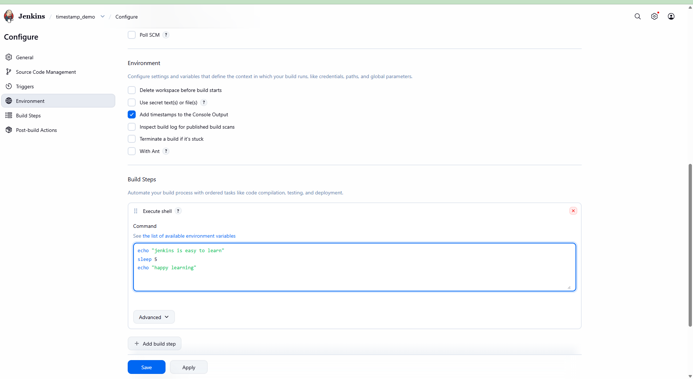

Clicked **Save** and then **Build Now**.

**Step 4: Verify the Console Output**

In the **Console Output** for Build **#1**, every line was prefixed with
the exact system clock time:

```
14:57:56 Started by user Saleem Ahmed
14:57:56 Running as SYSTEM
14:57:56 Building in workspace /var/lib/jenkins/workspace/timestamp_demo
14:57:56 [timestamp_demo] $ /bin/sh -xe /tmp/jenkins1093491002671749806.sh
14:57:57 + echo jenkins is easy to learn
14:57:57 jenkins is easy to learn
14:57:57 + sleep 5
14:58:02 + echo happy learning
14:58:02 happy learning
14:58:02 Finished: SUCCESS
```

> 📸 *Screenshot: `timestamp_demo` Build #1 Console Output — every line
> prefixed with the system clock time, sleep 5 visible between steps*

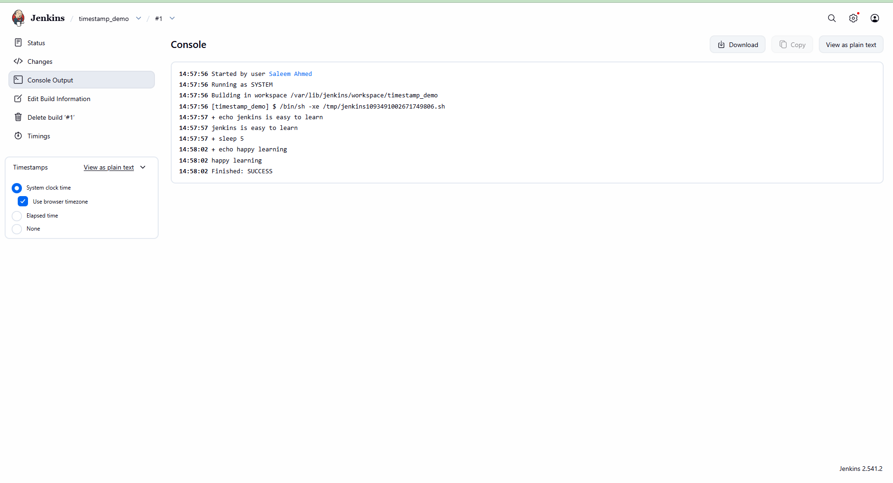

**Result:** The timestamps clearly show that `sleep 5` caused a 5-second
gap between `14:57:57` and `14:58:02` — exactly as expected. The entire
build from start to finish took 6 seconds.

---

### Part 2 — Terminate a Build if It's Stuck (Build Timeout)

The **Terminate a build if it's stuck** option automatically aborts a
build that runs longer than a defined time limit. This prevents runaway
builds from blocking the executor indefinitely — for example, a build
step that hangs waiting on a network resource or a process that never exits.

**Step 1: Create the Job**

Created a new Freestyle job called `timeout_job`:

> Jenkins Dashboard → New Item → Enter name: `timeout_job` → Freestyle Project → OK

**Step 2: Enable Build Timeout**

Inside `timeout_job → Configure → Environment`, checked the option:

> ✅ Terminate a build if it's stuck

This expanded the timeout configuration section with three fields:

| Field | Value Set | Description |
|---|---|---|
| **Time-out strategy** | `Absolute` | Aborts after a fixed number of minutes regardless of activity |
| **Timeout minutes** | `3` | The build will be forcefully terminated after 3 minutes |
| **Time-out actions** | `Fail the build` | Jenkins marks the build as FAILED when the timeout is reached |

**Step 3: Add a Build Step Designed to Time Out**

Under **Build Steps**, added an Execute shell step:

```bash
echo "hello how are you"
sleep 240
```

The `sleep 240` command pauses the build for 240 seconds (4 minutes) —
deliberately exceeding the 3-minute timeout to trigger the abort.

> 📸 *Screenshot: `timeout_job` Environment section — Terminate a build
> if it's stuck enabled, Absolute strategy, 3 minute timeout, Fail the
> build action*

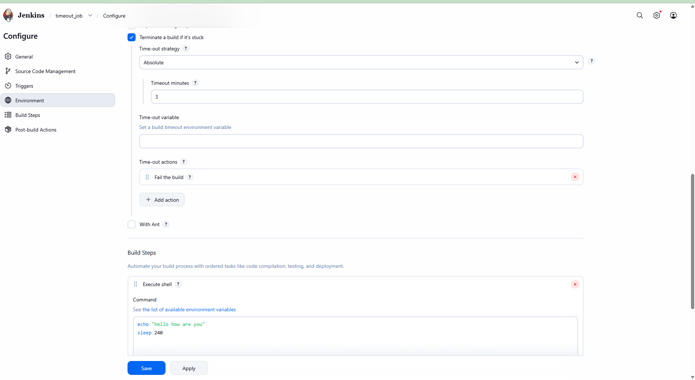

Clicked **Save** and then **Build Now**.

**Result:** Jenkins started the build, printed `hello how are you`, then
waited on `sleep 240`. After exactly 3 minutes, Jenkins detected that
the build had exceeded its timeout, forcefully terminated it, and marked
the build as **FAILED** — without any manual intervention.

---

### Part 3 — Build Parameters

Build Parameters make a job **dynamic** — instead of hardcoding values
into the build configuration, parameters let you pass different inputs
each time the job is triggered. Jenkins supports several parameter types.
Three are demonstrated in this lab: **String**, **Choice**, and
**Multi-line String**.

To access Build Parameters in any Jenkins job:
> **Job → Configure → General → ✅ This project is parameterized**

---

#### String Parameter

A String Parameter accepts a single line of free-text input. It is the
most common parameter type — used for names, version numbers, branch
names, usernames, or any single value that changes between builds.

**Step 1: Create the Job**

Created a new Freestyle job called `parametized_demo`:

> Jenkins Dashboard → New Item → Enter name: `parametized_demo` → Freestyle Project → OK

**Step 2: Enable Parameterization**

Inside `parametized_demo → Configure → General`, checked the option:

> ✅ This project is parameterized

**Step 3: Add a String Parameter**

Clicked **Add Parameter → String Parameter** and filled in:

| Field | Value |
|---|---|
| Name | `Name` |
| Default Value | `Saleem` |

> 📸 *Screenshot: `parametized_demo` — This project is parameterized
> checked, String Parameter `Name` with default value `Saleem`*

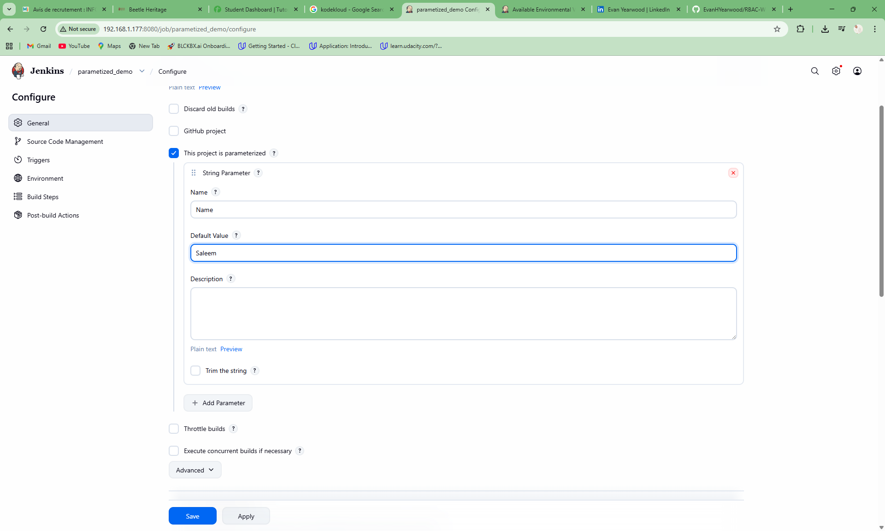

**Step 4: Add a Build Step**

Under **Build Steps**, added an Execute shell step:

```bash
echo Hello how are you
echo My name is ${Name}
```

Clicked **Save** and triggered the build using **Build with Parameters**.
The `Name` field was pre-filled with `Saleem` and left unchanged.

**Step 5: Verify the Console Output**

In the **Console Output** for Build **#1**:

```
Started by user Saleem Ahmed
Running as SYSTEM
Building in workspace /var/lib/jenkins/workspace/parametized_demo
[parametized_demo] $ /bin/sh -xe /tmp/jenkins1160145879393967514357.sh
+ echo Hello how are you
Hello how are you
+ echo My name is Saleem
My name is Saleem
Finished: SUCCESS
```

> 📸 *Screenshot: `parametized_demo` Build #1 Console Output — `${Name}`
> resolved to `Saleem`, build finished with SUCCESS*

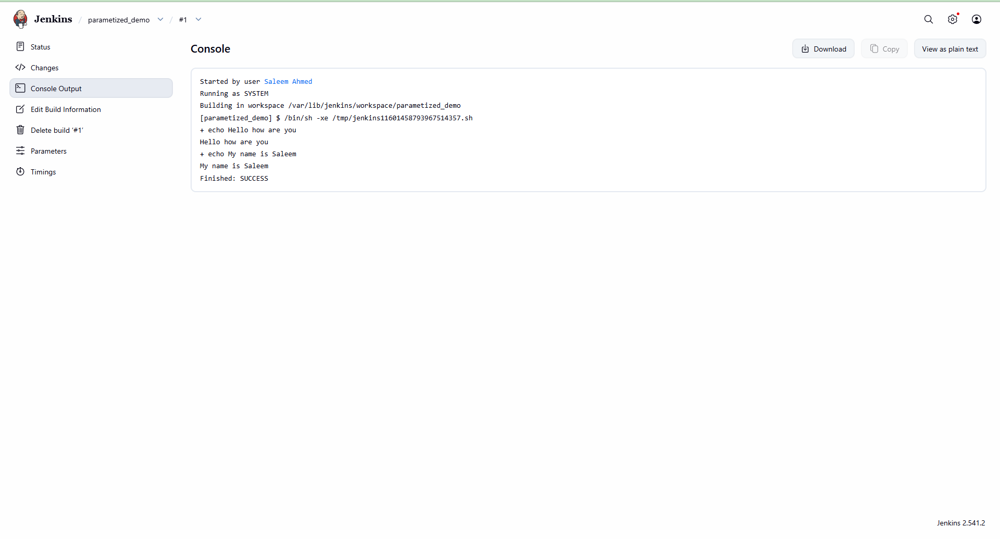

**Result:** Jenkins injected the `Name` parameter as an environment
variable, `${Name}` resolved to `Saleem` in the shell step, and the
build completed successfully.

---

#### Choice Parameter and Multi-line String Parameter

More complex parameter types give greater control over what values a user
can pass into a build.

**Choice Parameter** presents a dropdown menu of predefined options. The
user selects one value at trigger time — preventing free-text mistakes and
restricting inputs to only valid choices. Ideal for environment selectors,
region selectors, or any field with a known set of valid values.

**Multi-line String Parameter** accepts a block of text spanning multiple
lines. Useful for passing notes, messages, lists of items, or any input
that cannot fit on a single line.

**Step 5: Add a Choice Parameter**

Still inside `parametized_demo → Configure → General`, clicked
**Add Parameter → Choice Parameter** and filled in:

| Field | Value |
|---|---|
| Name | `environment` |
| Choices | `test` / `QA` / `Preprod` *(one per line)* |

This creates a dropdown that the user selects from when triggering the
build — choosing which environment to target.

**Step 6: Add a Multi-line String Parameter**

Clicked **Add Parameter → Multi-line String Parameter** and filled in:

| Field | Value |
|---|---|
| Name | `Mutiline` |
| Default Value | `This is my online Class` / `Hope you are doing well` / `feel free to ask any questions you may have` |

> 📸 *Screenshot: `parametized_demo` — Choice Parameter `environment`
> with choices `test`, `QA`, `Preprod` and Multi-line String Parameter
> `Mutiline` with a 3-line default value*

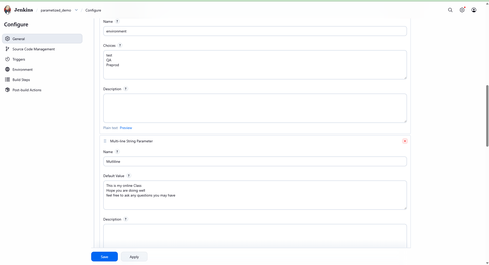

Clicked **Save** to apply all parameters.

**Result:** When triggering `parametized_demo` with **Build with
Parameters**, Jenkins now presents three input fields — a text box for
`Name`, a dropdown for `environment` (with `test`, `QA`, `Preprod`), and
a text area for `Mutiline`. Each value is injected as an environment
variable and available throughout all build steps.

---

### Part 4 — Retry Count

The **Retry Count** option tells Jenkins how many times to automatically
retry a failed SCM (Source Code Management) checkout before giving up and
marking the build as failed. This is useful when dealing with flaky network
connections or intermittently unavailable Git repositories.

**Step 1: Create the Job**

Created a new Freestyle job called `retry_counts-demo`:

> Jenkins Dashboard → New Item → Enter name: `retry_counts-demo` → Freestyle Project → OK

**Step 2: Enable Retry Count**

Inside `retry_counts-demo → Configure → General`, clicked **Advanced** to
expand the hidden options. Checked the option:

> ✅ Retry Count

In the **SCM checkout retry count** field, set the value:

```
0
```

> 📸 *Screenshot: `retry_counts-demo` Advanced General settings — Retry
> Count enabled with SCM checkout retry count set to 0*

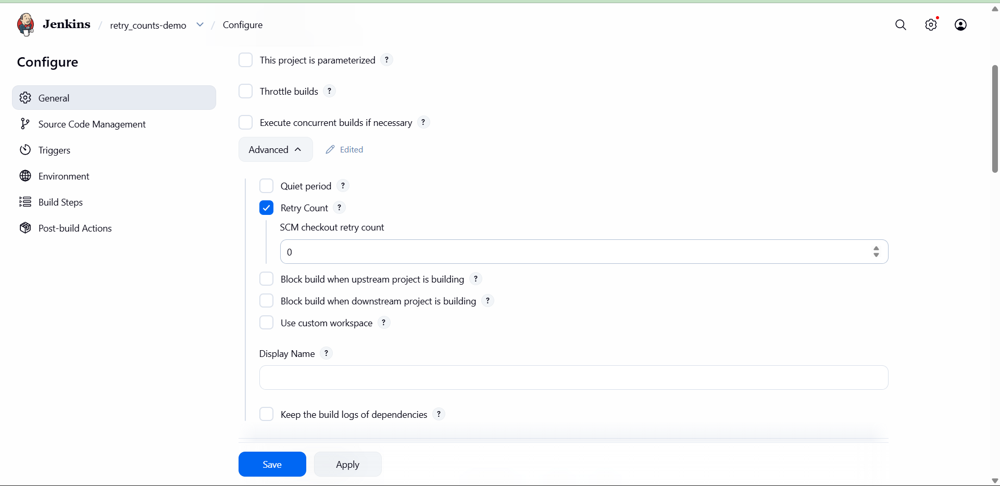

Clicked **Save** to apply.

**Step 3: Trigger the Build and Observe the Retry**

Clicked **Build Now**. Jenkins attempted to clone the configured Git
repository. When the checkout failed — because no valid branch revision
could be found — Jenkins automatically retried the SCM checkout after a
wait period before ultimately failing the build.

**Console Output for Build #5:**

```
Started by user Saleem Ahmed
Running as SYSTEM
Building in workspace /var/lib/jenkins/workspace/retry_counts-demo
The recommended git tool is: NONE
No credentials specified
> git rev-parse --resolve-git-dir /var/lib/jenkins/workspace/retry_counts-demo/.git
Fetching changes from the remote Git repository
> git config remote.origin.url https://github.com/SaleemAhmedAssanFai/Python-Simple-Projects.git
Fetching upstream changes from https://github.com/SaleemAhmedAssanFai/Python-Simple-Projects.git
> git --version # timeout=10
> git --version # 'git version 2.43.0'
> git fetch --tags --force --progress -- https://github.com/SaleemAhmedAssanFai/Python-Simple-Projects.git
ERROR: Couldn't find any revision to build. Verify the repository and branch configuration for this job.
Retrying after 10 seconds
...
```

> 📸 *Screenshot: `retry_counts-demo` Build #5 Console Output — SCM
> checkout fails, Jenkins automatically retries after 10 seconds*

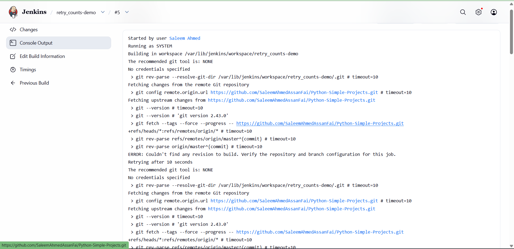

**Result:** Jenkins detected the SCM checkout failure, waited 10 seconds,
and retried the entire git fetch cycle automatically — without any manual
intervention. The retry count controls how many times this cycle repeats
before the build is permanently marked as failed.

---

### Part 5 — Throttle Builds

The **Throttle builds** option limits how many builds of a job can run
within a given time period. This prevents a job from overwhelming system
resources or a downstream service by being triggered too frequently —
for example, by rapid commits or aggressive polling.

**Step 1: Create the Job**

Created a new Freestyle job called `throttle-build-demo`:

> Jenkins Dashboard → New Item → Enter name: `throttle-build-demo` → Freestyle Project → OK

**Step 2: Enable Throttle Builds**

Inside `throttle-build-demo → Configure → General`, checked the option:

> ✅ Throttle builds

This expanded the throttle configuration section:

| Field | Value Set | Description |
|---|---|---|
| **Number of builds** | `2` | Maximum number of builds allowed within the time period |
| **Time period** | `Minute` | The window in which the build limit applies |

Jenkins displayed the calculated rate: **Approximately 30 seconds between
builds** — meaning no two builds can run closer together than 30 seconds.

> 📸 *Screenshot: `throttle-build-demo` — Throttle builds enabled,
> Number of builds set to 2, Time period set to Minute*

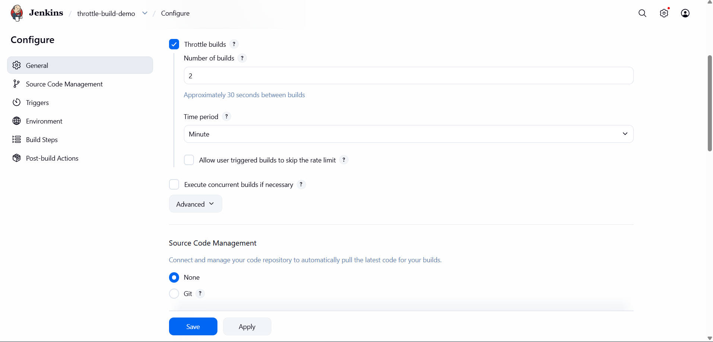

Clicked **Save** to apply.

**Result:** With throttling active, if the job is triggered more than
twice per minute, Jenkins queues the excess builds and releases them
according to the rate limit — protecting downstream systems from being
flooded with rapid successive builds.

---

### Part 6 — Execute Concurrent Builds and Use Custom Workspace

#### Execute Concurrent Builds

By default, Jenkins only allows **one build of a job to run at a time**.
Any new trigger while a build is in progress is queued and waits. The
**Execute concurrent builds if necessary** option lifts this restriction —
allowing multiple builds of the same job to run simultaneously on
available executors.

**Step 1: Create the Job**

Created a new Freestyle job called `concurrent-demo`:

> Jenkins Dashboard → New Item → Enter name: `concurrent-demo` → Freestyle Project → OK

**Step 2: Enable Concurrent Builds**

Inside `concurrent-demo → Configure → General`, checked the option:

> ✅ Execute concurrent builds if necessary

> 📸 *Screenshot: `concurrent-demo` — Execute concurrent builds if
> necessary checked in General configuration*

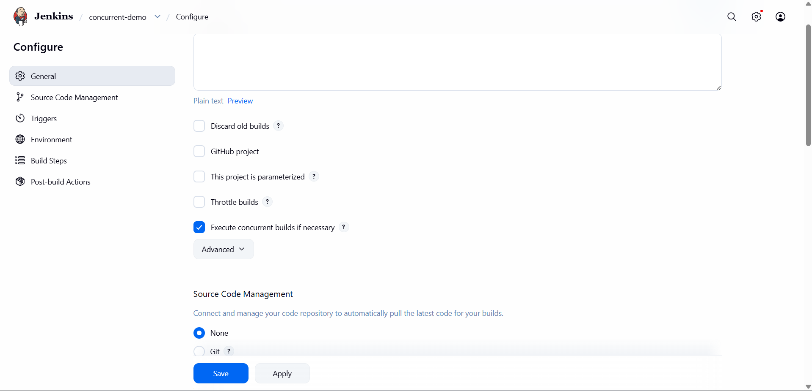

Clicked **Save** to apply.

**Step 3: Trigger Multiple Builds Rapidly**

Clicked **Build Now** several times in quick succession. Jenkins accepted
all the build requests simultaneously instead of queuing them.

**Result:** The job status page showed builds **#4 through #8** completing
successfully while build **#9** was shown as **Pending — Waiting for next
available executor**. This confirmed that concurrent builds were being
processed simultaneously, limited only by the number of available
executors on the Jenkins agent.

> 📸 *Screenshot: `concurrent-demo` Status — builds #4–#8 completed,
> build #9 pending waiting for next available executor*

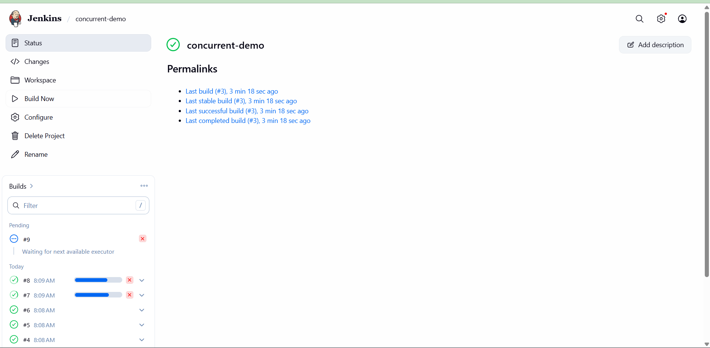

---

#### Use Custom Workspace

By default, Jenkins checks out code and runs build steps inside:
```
/var/lib/jenkins/workspace/JOB_NAME
```

The **Use custom workspace** option overrides this with any directory path
of your choosing. This is useful when a build tool expects code to be in
a specific location, or when multiple jobs need to share a common working
directory.

**Step 3: Enable Use Custom Workspace**

Still inside the Advanced section of `throttle-build-demo → Configure →
General`, checked the option:

> ✅ Use custom workspace

In the **Directory** field, entered:

```
/tmp/mycustomizedspace
```

> 📸 *Screenshot: `throttle-build-demo` Advanced — Use custom workspace
> enabled with directory set to /tmp/mycustomizedspace*

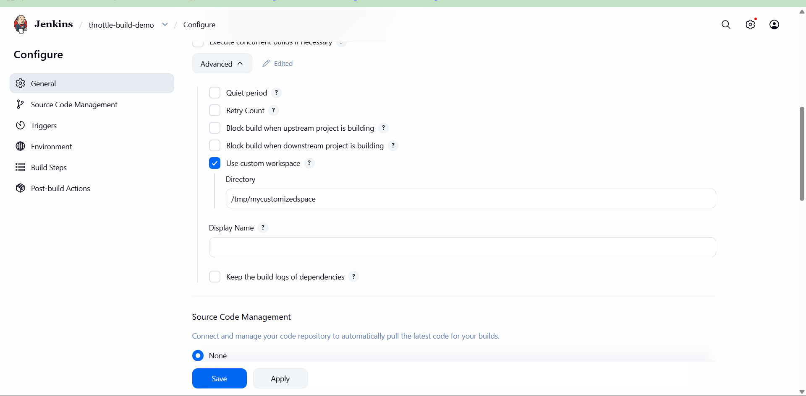

Clicked **Save** to apply.

**Result:** On the next build, Jenkins used `/tmp/mycustomizedspace` as
the working directory instead of the default workspace path. All build
steps, file reads, and file writes happened relative to this custom path.

---

## 🔑 Key Lessons Learned (Build Environments)

**1. Timestamps Make Debugging Measurable**

Without timestamps, a console log is just a list of lines. With timestamps
enabled, every line carries the exact time it ran — making it trivial to
identify which step is slow, how long a build actually took, and where
time is being lost.

**2. Build Timeouts Protect the Executor**

A hung build without a timeout blocks the Jenkins executor indefinitely,
preventing all other jobs from running. Setting a timeout with `Fail the
build` as the action ensures a stuck build is detected, aborted, and
reported — freeing the executor for the next job.

**3. The Absolute Strategy Enforces a Hard Deadline**

The Absolute timeout strategy terminates a build after a fixed number of
minutes regardless of what it is doing. Set the timeout generously enough
to allow normal builds to complete, but short enough to catch genuinely
stuck ones.

**4. Parameters Eliminate Hardcoded Values**

Every value hardcoded into a job configuration is a value that must be
manually changed when requirements shift. Parameters move those values to
trigger time — making the same job reusable across environments, branches,
or any other dimension that changes between runs.

**5. Choice Parameters Enforce Valid Inputs**

A free-text String Parameter can receive any value, including typos or
invalid options. A Choice Parameter restricts the input to a predefined
list — preventing misconfigured builds before they start. Use it whenever
a field has a known, finite set of valid values.

**6. Multi-line Parameters Handle Complex Inputs**

Some build inputs cannot fit on one line — release notes, lists of
targets, or multi-step instructions. The Multi-line String Parameter
accepts a full block of text, keeping the job configuration clean while
still passing rich data into the build.

**7. Retry Count Handles Flaky SCM Connections**

Network issues and intermittent Git host errors can cause a healthy build
to fail at the checkout stage. Setting a retry count gives Jenkins a
second (or third) chance to fetch the code before giving up — preventing
false failures caused by temporary connectivity problems.

**8. Throttle Builds Protect Downstream Systems**

Rapid-fire builds triggered by frequent commits or aggressive polling can
overwhelm a downstream service, a shared resource, or the Jenkins executor
itself. Throttling enforces a minimum gap between builds, keeping load
predictable and controlled.

**9. Concurrent Builds Maximize Executor Utilisation**

When a job takes a long time to run and multiple triggers arrive, queuing
them sequentially wastes time. Enabling concurrent builds lets Jenkins
run multiple instances of the same job in parallel — cutting total wait
time when executors are available.

**10. Custom Workspaces Enable Precise Build Isolation**

The default workspace path is fine for most jobs, but some build tools,
shared pipelines, or deployment scripts require code to live at a specific
path. A custom workspace gives you full control over where Jenkins places
the build files.

---

## 🔄 Build Pipeline

A **Build Pipeline** in Jenkins is a visual representation of a sequence
of jobs that are chained together — where the successful completion of one
job automatically triggers the next. Instead of managing individual jobs
in isolation, a pipeline gives you an end-to-end view of the entire
delivery process: from build, through test, to deployment.

The **Build Pipeline Plugin** extends Jenkins with a dedicated pipeline
view that shows each job as a stage card, the flow of execution between
them with arrows, and real-time build status using colour-coded indicators —
green for success, yellow for in-progress, and blue/grey for not yet run.

---

### Phase 1 — Install the Required Plugins

The Build Pipeline view requires two plugins that are not bundled with
Jenkins by default: **Build Pipeline** and **Parameterized Trigger**.

**Step 1: Open Plugin Manager**

From the Jenkins Dashboard, navigated to:

> Manage Jenkins → Plugins → Available plugins

**Step 2: Search and Install**

Searched for and selected the following two plugins:

| Plugin | Purpose |
|---|---|
| **Build Pipeline** | Adds the pipeline view and stage card visualisation |
| **Parameterized Trigger** | Allows upstream jobs to pass parameters to downstream jobs |

Clicked **Install** and waited for the download and installation to complete.

> 📸 *Screenshot: Plugin download progress page — Parameterized Trigger
> and Build Pipeline both showing ✅ Success*


Both plugins installed successfully without requiring a Jenkins restart.
The page confirmed that plugin extensions were loaded and ready to use.

---

### Phase 2 — Create the Upstream and Downstream Jobs

A pipeline requires at least two jobs connected by a Post-build Action —
an **upstream** job that triggers and a **downstream** job that is triggered.

**Step 3: Create the Upstream Job — `project-build`**

Created a new Freestyle job:

> Jenkins Dashboard → New Item → Enter name: `project-build` → Freestyle Project → OK

Under **Build Steps**, added an Execute shell step:

```bash
echo "Building the project..."
sleep 10
echo "Build complete."
```

**Step 4: Configure the Post-build Action to Chain Jobs**

Inside `project-build → Configure`, scrolled to the **Post-build Actions**
section and clicked:

> Add post-build action → Build other projects

In the **Projects to build** field, entered the name of the downstream job:

```
project-deploy
```

Selected the trigger condition:

> 🔵 Trigger only if build is stable

This ensures `project-deploy` is only triggered when `project-build`
completes with a SUCCESS status — not if it fails or is unstable.

> 📸 *Screenshot: `project-build` Post-build Actions — Build other projects
> configured with `project-deploy` as the downstream target, trigger only
> if build is stable selected*


Clicked **Save** to apply.

**Step 5: Create the Downstream Job — `project-deploy`**

Created a second Freestyle job:

> Jenkins Dashboard → New Item → Enter name: `project-deploy` → Freestyle Project → OK

Under **Build Steps**, added an Execute shell step:

```bash
echo "Deploying the project..."
sleep 10
echo "Deployment complete."
```

Clicked **Save**.

---

### Phase 3 — Create the Pipeline View

With the jobs created and linked, the next step is to create a dedicated
pipeline view to visualise the flow.

**Step 6: Create a New View**

From the Jenkins Dashboard, clicked the **+** icon next to the existing
views (All, etc.) to create a new view:

> Jenkins Dashboard → + (New View) → Enter view name: `myproject1` → Build Pipeline View → OK

**Step 7: Configure the Pipeline View**

Inside the pipeline view configuration, set up the **Pipeline Flow**:

| Field | Value |
|---|---|
| **Layout** | `Based on upstream/downstream relationship` |
| **Select Initial Job** | `project-build` |
| **Build Cards** | `Standard build card` |

The layout mode derives the pipeline structure automatically from the
upstream/downstream trigger relationships between jobs — no manual ordering
required.

> 📸 *Screenshot: Pipeline view Edit View configuration — Pipeline Flow
> section, layout set to upstream/downstream relationship, initial job
> set to `project-build`*


Clicked **Save** to apply.

---

### Phase 4 — Run the Pipeline

**Step 8: Trigger the Pipeline**

Inside the `myproject1` pipeline view, clicked the **Run** button.
Jenkins started `project-build` (Build **#2**).

Upon successful completion of `project-build`, Jenkins automatically
triggered `project-deploy` — exactly as configured in the Post-build Action.

> 📸 *Screenshot: `myproject1` Build Pipeline view — `project-build` #2
> shown in green (SUCCESS), arrow pointing to `project-deploy` (cyan/queued)*


**Result:** The pipeline view showed both stages side by side with a
directional arrow between them. `project-build` completed in 10 seconds
and automatically handed off execution to `project-deploy` — the entire
delivery chain ran without any manual intervention between stages.

---

### Phase 5 — Continuous Delivery Pipeline (Multi-Stage)

To simulate a real-world Continuous Delivery workflow, a three-stage
pipeline was built using three chained jobs: **test1 → staging → prod**.
Each stage represents a promotion gate — code only advances to the next
environment when the current stage succeeds.

**Step 9: Create the Three-Stage Jobs**

Created three Freestyle jobs in sequence:

| Job Name | Role | Triggers |
|---|---|---|
| `test1` | First stage — runs tests | Triggers `staging` on success |
| `staging` | Second stage — staging deployment | Triggers `prod` on success |
| `prod` | Third stage — production deployment | End of pipeline |

Each job used the same Post-build Action pattern as before:

> Post-build Actions → Build other projects → [next job name] → Trigger only if build is stable

**Step 10: Create the Continuous Delivery View**

Created a new Build Pipeline view called `continuousdelivery` with
`test1` set as the Initial Job.

**Step 11: Run the Continuous Delivery Pipeline**

Triggered the pipeline from the view. Jenkins executed all three stages
sequentially — `test1` completed, triggered `staging`, which completed
and triggered `prod`.

> 📸 *Screenshot: `continuousdelivery` Build Pipeline view — `test1` #1
> (green, complete), `staging` #1 (green, complete), `prod` #1 (yellow,
> in-progress with progress bar)*


**Result:** The three-stage pipeline ran end-to-end. The pipeline view
showed live status for each stage — green cards for completed stages and
a yellow progress bar on the active stage. Code flowed automatically from
test to staging to production with no manual steps between promotions.

---

### Phase 6 — Parallel Jobs in a Pipeline

Jenkins Build Pipeline also supports **parallel execution** — where
multiple downstream jobs are triggered from a single upstream job at the
same time. This is useful when two or more independent tasks (such as
deploying to two separate environments simultaneously) can run in parallel
without waiting for each other.

**Step 12: Configure a Job to Trigger Multiple Downstreams**

Inside `test1 → Configure → Post-build Actions`, the **Build other projects**
field was updated to list two downstream jobs separated by a comma:

```
staging, staging2
```

With **Trigger only if build is stable** selected, both `staging` and
`staging2` would be triggered simultaneously whenever `test1` succeeded.

**Step 13: Run the Parallel Pipeline**

Triggered the pipeline from the `continuousdelivery` view. Jenkins
started `test1`, and upon its success, triggered both `staging` and
`staging2` at the same time.

> 📸 *Screenshot: `continuousdelivery` Build Pipeline view — `test1` #2
> (green), branching into `staging` #2 (green) and `staging2` #1 (green)
> running in parallel, both feeding into `prod` #2 (green, complete)*


**Result:** The pipeline view rendered the parallel branches clearly —
`test1` triggering two separate cards (`staging` and `staging2`) side by
side below the main flow line, both completing before `prod` was triggered.
This confirmed that Jenkins correctly handled fan-out execution in a
Build Pipeline view.

---

## 🔑 Key Lessons Learned (Build Pipeline)

**1. The Build Pipeline Plugin Transforms Job Chains into Visible Stages**

Without the plugin, upstream/downstream relationships between jobs are
invisible — you only know a job triggered another by reading logs. The
Build Pipeline view makes the entire chain visible at a glance, with
colour-coded status per stage and directional arrows showing flow.

**2. Post-build Actions Are the Glue Between Pipeline Stages**

The connection between two jobs in a pipeline is always defined in the
upstream job's **Post-build Actions** section using **Build other projects**.
There is no special pipeline-level configuration — the view simply reads
the existing trigger relationships.

**3. "Trigger Only If Build Is Stable" Is the Right Default**

Choosing this option ensures that a failure in any stage stops the pipeline
from advancing. Code that fails tests does not get deployed to staging.
Code that fails staging does not reach production. This is the foundation
of safe, automated delivery.

**4. The Initial Job Anchors the Entire View**

The pipeline view derives its structure by following the trigger chain
starting from the **Initial Job**. Set this to the very first job in your
delivery sequence — everything downstream is discovered automatically.

**5. Parallel Branches Maximise Throughput**

When two downstream tasks are independent of each other, there is no
reason to run them sequentially. Listing multiple jobs in the
**Build other projects** field (comma-separated) triggers them all at once
— cutting total pipeline time when executors are available.

**6. Colour Coding Gives Instant Build Health Feedback**

Green = SUCCESS, Yellow = IN PROGRESS, Blue/Grey = NOT YET RUN. A single
look at the pipeline view tells you exactly where the pipeline stands
without opening a single job log.

**7. Pipeline Views Are Read-Only Visualisations**

The Build Pipeline view does not change how jobs work — it only visualises
the upstream/downstream relationships that already exist. You can delete
the view without affecting any job or trigger configuration.

---

## 🚀 Deploy Artifacts to Tomcat Server (Manually)

This section covers the full workflow for building a Spring Boot web application
into a deployable WAR artifact using Maven, and then manually deploying that
artifact to a locally running Apache Tomcat 10 server. This is the foundation
for understanding what Jenkins automates in the next section — here every step
is performed by hand so the mechanics are fully understood before automation
is introduced.

**Tech stack used in this lab:**

| Component | Detail |
|---|---|
| Application | Spring Boot WAR example (`hello-world-0.0.1-SNAPSHOT`) |
| Build tool | Apache Maven |
| Application server | Apache Tomcat 10 |
| OS | Ubuntu (VirtualBox VM) |
| Java | OpenJDK 21 |

---

### Phase 1 — Run Maven Unit Tests

Before packaging, always run the test suite to verify that the application
code is correct. Maven's `test` lifecycle phase compiles the source, resolves
all test dependencies, and executes every unit test found in the project.

**Step 1: Navigate to the project directory**

```bash
cd ~/spring-boot-war-example
```

**Step 2: Run the Maven test phase**

```bash
mvn test
```

Maven resolved and downloaded all required dependencies from Maven Central —
including test framework libraries — then executed the test suite. The output
confirmed:

```
[INFO] No tests to run.
[INFO] BUILD SUCCESS
[INFO] Total time: 03:12 min
[INFO] Finished at: 2026-04-27T16:39:15+01:00
```

> 📸 *Screenshot: Terminal — `mvn test` completing with BUILD SUCCESS,
> total time 3:12 min, no tests to run in this project*


**Result:** The test phase passed cleanly. `No tests to run` is expected for
this skeleton project — in a real application, unit tests would be executed
and reported here. BUILD SUCCESS confirms the source compiles and all
dependencies resolve correctly.

---

### Phase 2 — Package the Application into a WAR File

With tests passing, the next step is to package the application into a
deployable artifact. The `mvn package` command compiles the source, runs
tests, and then bundles the compiled classes and all dependencies into a
single WAR (Web Application Archive) file.

**Step 3: Run the Maven package phase**

```bash
mvn package
```

Maven downloaded additional packaging dependencies — including Spring Boot's
repackaging plugin — compiled the source, ran the tests, and then executed
the repackaging step. The final output confirmed:

```
[INFO] Replacing main artifact with repackaged archive
[INFO] BUILD SUCCESS
[INFO] Total time: 01:24 min
[INFO] Finished at: 2026-04-27T16:43:14+01:00
```

> 📸 *Screenshot: Terminal — `mvn package` completing with BUILD SUCCESS,
> total time 1:24 min, repackaged archive replacing main artifact*


**What "Replacing main artifact with repackaged archive" means:**
Spring Boot's Maven plugin takes the standard WAR produced by Maven and
replaces it with a **fat WAR** — a WAR that includes all runtime dependencies
embedded inside it. This makes it fully self-contained and deployable to any
servlet container without needing external classpath configuration.

---

### Phase 3 — Verify the WAR Artifact in the Target Directory

After a successful `mvn package`, Maven places all build outputs in the
`target/` directory. Verify the WAR file exists and check its size before
deploying it.

**Step 4: List the project root and inspect the target directory**

```bash
ls -ltr
cd target
ls -ltr
```

The project root showed all expected source files — `pom.xml`, `Jenkinsfile`,
`setup.sh`, `scripts/`, `src/`. The `target/` directory was created at
`16:43` — matching the package build timestamp.

Inside `target/`, the full listing confirmed:

```
drwxrwxr-x  3 leem leem      4096 Apr 27 16:38  generated-sources
drwxrwxr-x  3 leem leem      4096 Apr 27 16:38  maven-status
drwxrwxr-x  3 leem leem      4096 Apr 27 16:38  classes
drwxrwxr-x  4 leem leem      4096 Apr 27 16:42  hello-world-0.0.1-SNAPSHOT
drwxrwxr-x  2 leem leem      4096 Apr 27 16:42  maven-archiver
-rw-rw-r--  1 leem leem  11081609 Apr 27 16:42  hello-world-0.0.1-SNAPSHOT.war.original
-rw-rw-r--  1 leem leem  16513838 Apr 27 16:43  hello-world-0.0.1-SNAPSHOT.war
```

> 📸 *Screenshot: Terminal — `ls -ltr` in project root, then `cd target`
> and `ls -ltr` showing `hello-world-0.0.1-SNAPSHOT.war` at 16.5 MB*


**Key observations from the target directory:**

| File | Size | Meaning |
|---|---|---|
| `hello-world-0.0.1-SNAPSHOT.war.original` | 11 MB | The standard Maven WAR (without embedded dependencies) |
| `hello-world-0.0.1-SNAPSHOT.war` | 16.5 MB | The Spring Boot fat WAR — fully self-contained, ready to deploy |

The fat WAR is ~5 MB larger because Spring Boot embedded all runtime
dependencies directly into the archive. This is the file that gets deployed
to Tomcat.

---

### Phase 4 — Verify Apache Tomcat 10 Is Running

Before deploying the WAR, confirm that the Tomcat 10 service is active
and listening. On Ubuntu, Tomcat runs as a systemd service.

**Step 5: Check the Tomcat 10 service status**

```bash
systemctl status tomcat10
```

The output confirmed the service is fully operational:

```
● tomcat10.service - Apache Tomcat 10 Web Application Server
     Loaded: loaded (/usr/lib/systemd/system/tomcat10.service; enabled; preset: enabled)
     Active: active (running) since Mon 2026-04-27 17:24:41 WAT; 3s ago
   Main PID: 32371 (java)
     Memory: 121.2M (peak: 121.2M)
```

The service log confirmed the full Tomcat startup sequence — Catalina
service starting, Servlet engine initialising, and web application deployment
beginning.

> 📸 *Screenshot: Terminal — `systemctl status tomcat10` showing
> `active (running)`, Main PID 32371, memory 121.2M, Catalina starting,
> Servlet engine starting, web application deploying*


**Result:** Tomcat 10 is `active (running)` and fully initialised. The
`enabled` flag confirms it is configured to start automatically on boot.
OpenSSL initialised successfully and the Catalina servlet engine is ready
to serve web applications.

---

### Phase 5 — Deploy the WAR to Tomcat's webapps Directory

Tomcat automatically detects and deploys any WAR file placed in its
`webapps/` directory. The deployment process is: copy the WAR → Tomcat
detects it → Tomcat expands it → application is live.

**Step 6: Navigate to Tomcat's webapps directory**

```bash
cd /var/lib/tomcat10/webapps/
pwd
ls -ltr
```

The webapps directory contained only the default `ROOT` application —
confirming no custom apps are deployed yet.

**Step 7: Copy the WAR file into webapps as `app.war`**

The WAR was copied using `sudo` (required because the webapps directory
is owned by root) and renamed to `app.war` — this controls the context
path the application will be accessible at (`/app`):

```bash
sudo cp ~/spring-boot-war-example/target/hello-world-0.0.1-SNAPSHOT.war \
  /var/lib/tomcat10/webapps/app.war
```

**Step 8: Verify the deployment**

```bash
ls -ltr
```

The listing confirmed the WAR was copied and Tomcat immediately began
expanding it:

```
drwxr-xr-x  3 root    root         4096 Apr 27 16:58  ROOT
-rw-r--r--  1 root    root     16513838 Apr 27 17:35  app.war
drwxr-x---  5 tomcat  tomcat       4096 Apr 27 17:35  app
```

> 📸 *Screenshot: Terminal — navigating to `/var/lib/tomcat10/webapps`,
> `sudo cp` copying the WAR as `app.war`, `ls -ltr` confirming `app.war`
> (16.5 MB) and the expanded `app/` directory owned by tomcat*


**What happened automatically:**

| Event | Description |
|---|---|
| WAR copied as `app.war` | Sets the application context path to `/app` |
| `app/` directory created | Tomcat auto-expanded the WAR into a deployment directory |
| Owner changed to `tomcat:tomcat` | Tomcat took ownership of the expanded application |

**Result:** The Spring Boot WAR was deployed to Tomcat 10 successfully.
The application is now accessible at `http://localhost:8080/app`. Tomcat
detected the new WAR, expanded it automatically, and served it —
with zero Tomcat restart required.

---

## 🔑 Key Lessons Learned (Deploy Artifacts to Tomcat)

**1. Always Run Tests Before Packaging**

`mvn test` and `mvn package` are separate lifecycle phases. Running
`test` first gives you fast feedback — if tests fail, you know immediately
without waiting for the full packaging cycle. In automated pipelines,
a failing test should always block the package step.

**2. Spring Boot Produces Two WAR Files**

After `mvn package`, the `target/` directory contains both
`*.war.original` (the standard Maven WAR, without embedded dependencies)
and `*.war` (the Spring Boot fat WAR, with all dependencies embedded).
Always deploy the larger `*.war` — it is the one that actually runs
standalone on Tomcat without external classpath setup.

**3. The WAR Filename Sets the Context Path**

When Tomcat deploys `app.war`, the application is accessible at `/app`.
Deploying as `ROOT.war` would make it accessible at `/` (the root context).
Choose the filename deliberately — it directly determines the URL path
your users will hit.

**4. Tomcat Auto-Deploys — No Restart Needed**

Tomcat monitors its `webapps/` directory. Dropping a WAR file in is
enough — Tomcat detects the new file, expands it, and serves it. The
`app/` directory appearing alongside `app.war` is proof that auto-deployment
completed successfully.

**5. `sudo` Is Required for the webapps Directory**

The `/var/lib/tomcat10/webapps/` directory is owned by `root`. Regular
user `cp` commands fail with a permission error. Always use `sudo cp`
or add your user to the `tomcat` group when deploying manually.

**6. Check `systemctl status` Before Every Deployment**

Copying a WAR to a stopped Tomcat instance does nothing — the file sits
inert until Tomcat starts. Always verify `active (running)` before
deploying. In Jenkins pipelines, a dedicated pre-deployment health-check
step should confirm Tomcat is up before attempting the copy.

**7. Manual Deployment Is the Foundation for Automation**

Every step performed manually in this lab — test, package, verify, copy —
maps directly to a Jenkins pipeline stage. Understanding what each command
does and why makes it straightforward to translate the workflow into a
`Jenkinsfile` in the next section.

---

## 📜 Declarative Pipeline

A **Declarative Pipeline** in Jenkins is a structured way to define an entire
CI/CD workflow as code — written in Groovy and stored directly in Jenkins or
in a `Jenkinsfile` in your source repository. Unlike Freestyle jobs where you
click through a UI to add build steps one at a time, a Declarative Pipeline
describes the complete pipeline — all its stages, steps, agents, and
conditions — in a single, version-controlled script.

The Declarative syntax is Jenkins' recommended approach. It enforces a clean,
readable structure and makes complex pipelines maintainable by anyone on the
team who can read code.

To create a Pipeline job in Jenkins:
> **Jenkins Dashboard → New Item → Enter name → Pipeline → OK**

---

### The Anatomy of a Declarative Pipeline

Every Declarative Pipeline follows the same top-level structure:

```groovy
pipeline {
    agent any          // Where to run — any available Jenkins agent
    stages {           // Container for all pipeline stages
        stage('Name') {  // A named stage — appears in Stage View
            steps {      // The actual commands to run
                echo 'Hello'
            }
        }
    }
}
```

| Block | Required | Purpose |
|---|---|---|
| `pipeline { }` | ✅ Yes | Outer wrapper — every Declarative Pipeline must start with this |
| `agent any` | ✅ Yes | Tells Jenkins to run on any available executor |
| `stages { }` | ✅ Yes | Contains all `stage()` blocks |
| `stage('Name') { }` | ✅ Yes (at least one) | A named unit of work — name appears in Stage View |
| `steps { }` | ✅ Yes | Contains the actual commands inside a stage |

---

### Part 1 — Create a Pipeline Job and Write a Hello World Script

**Step 1: Create the Pipeline job**

> Jenkins Dashboard → New Item → Enter name: `pipelines-code-example` → Pipeline → OK

**Step 2: Navigate to the Pipeline section**

Inside `pipelines-code-example → Configure`, clicked **Pipeline** in the
left sidebar. Set the **Definition** dropdown to:

> Pipeline script

This tells Jenkins the pipeline will be written directly in the browser's
script editor — not pulled from a `Jenkinsfile` in a Git repository.

**Step 3: Write the Hello World pipeline script**

In the **Script** editor, the built-in **Hello World** template was loaded
from the dropdown in the top-right corner of the script editor. This
populated the editor with the minimal valid Declarative Pipeline:

```groovy
pipeline {
    agent any

    stages {
        stage('Hello') {
            steps {
                echo 'Hello World'
            }
        }
    }
}
```

> 📸 *Screenshot: `pipelines-code-example` Configure → Pipeline — Definition
> set to Pipeline script, Hello World template loaded in the script editor,
> Use Groovy Sandbox checked*


**What each line does:**

| Line | Meaning |
|---|---|
| `pipeline { }` | Declares this as a Declarative Pipeline |
| `agent any` | Run on any available Jenkins executor/node |
| `stages { }` | Wrapper for all stages in the pipeline |
| `stage('Hello') { }` | A single stage named "Hello" — visible in Stage View |
| `steps { }` | Contains the commands to run in this stage |
| `echo 'Hello World'` | Prints "Hello World" to the Console Output |

Clicked **Save** to apply.

---

### Part 2 — Build a Multi-Stage Pipeline with Shell Commands

A single-stage Hello World pipeline demonstrates syntax but doesn't model
a real CI/CD workflow. In practice, pipelines have multiple sequential stages —
each representing a distinct phase of the delivery process. This part extends
the pipeline to four stages and introduces `sh` steps to run real shell
commands inside stages.

**Step 4: Update the pipeline script to four stages**

Inside `pipelines-code-example → Configure → Pipeline`, replaced the
Hello World script with the following four-stage Declarative Pipeline:

```groovy
pipeline {
    agent any

    stages {
        stage('Checkout the Project') {
            steps {
                sh 'date'
                sh 'pwd'
            }
        }
        stage('Build the Package') {
            steps {
                echo 'Build the Package'
            }
        }
        stage('Deploy the Package to Test Environment') {
            steps {
                echo 'Deploy the Package to Test Environment'
            }
        }
        stage('Deploy the Package to Prod Environment') {
            steps {
                echo 'Deploy the Package to Prod Environment'
            }
        }
    }
}
```

> 📸 *Screenshot: `pipelines-code-example` Configure → Pipeline — four-stage
> Declarative Pipeline script showing stages: Checkout the Project (with sh steps),
> Build the Package, Deploy the Package to Test Environment (lines 4–18 visible)*


**Breaking down the four stages:**

| Stage | Steps | Models |
|---|---|---|
| `Checkout the Project` | `sh 'date'`, `sh 'pwd'` | Source code checkout phase — shell commands run and print system info |
| `Build the Package` | `echo 'Build the Package'` | Compilation/packaging phase |
| `Deploy the Package to Test Environment` | `echo 'Deploy...'` | Test environment deployment phase |
| `Deploy the Package to Prod Environment` | `echo 'Deploy...'` | Production deployment phase |

**The `sh` step vs `echo`:**

- `sh 'command'` — executes a shell command on the Jenkins agent's OS.
  The command's stdout and stderr appear in the Console Output.
- `echo 'text'` — a Jenkins pipeline built-in that prints text to the
  Console Output without invoking a shell.

> 📸 *Screenshot: Same four-stage pipeline script in wider browser view —
> full Configure page visible with Pipeline section active*


Clicked **Save** to apply.

---

### Part 3 — Run the Pipeline and Read the Stage View

**Step 5: Trigger the pipeline**

Clicked **Build Now** from the `pipelines-code-example` status page.
Jenkins queued and executed the pipeline, running all four stages sequentially.

**Step 6: Read the Stage View**

After Build **#2** completed, the **Stage View** on the job's status page
showed all four stages as columns, with their individual execution times
and a colour-coded result for each build run:

| Stage | Time (Build #2) | Result |
|---|---|---|
| Checkout the Project | 629 ms | ✅ Success |
| Build the Package | 411 ms | ✅ Success |
| Deploy the Package to Test Environment | 762 ms | ✅ Success |
| Deploy the Package to Prod Environment | 448 ms | ✅ Success |
| **Full run time** | **~14 s** | ✅ Overall SUCCESS |

> 📸 *Screenshot: `pipelines-code-example` Status — Stage View showing
> Build #2 (Apr 30, 10:44) with all four stages in green, average stage
> times displayed, Builds #1 and #2 both showing ✅ in the sidebar*


> 📸 *Screenshot: Same Stage View in wider browser — full pipeline job
> page with sidebar navigation, Stage View grid, and Permalinks section*


**Result:** Both builds completed successfully. The Stage View provided an
at-a-glance health dashboard for every stage — making it immediately clear
which stage is slowest (Deploy to Test at 762ms) and whether any stage failed.
Average stage times are shown across the top row, giving a trend baseline
for future builds.

---

### Part 4 — Read the Console Output

The Console Output provides a line-by-line execution trace of everything
Jenkins and the pipeline script did during a build. It is the primary
diagnostic tool when a build fails.

**Step 7: Open the Console Output for Build #3**

Navigated to:

> `pipelines-code-example` → Build #3 → Console Output

The full execution trace for Build **#3**:

```
Started by user Saleem Ahmed
[Pipeline] Start of Pipeline
[Pipeline] node
Running on Jenkins in /var/lib/jenkins/workspace/pipelines-code-example
[Pipeline] {
[Pipeline] stage
[Pipeline] { (Checkout the Project)
[Pipeline] sh
+ date
Thu Apr 30 10:57:24 AM WAT 2026
[Pipeline] sh
+ pwd
/var/lib/jenkins/workspace/pipelines-code-example
[Pipeline] }
[Pipeline] // stage
[Pipeline] stage
[Pipeline] { (Build the Package)
[Pipeline] echo
Build the Package
[Pipeline] }
[Pipeline] // stage
[Pipeline] stage
[Pipeline] { (Deploy the Package to Test Environment)
[Pipeline] echo
Deploy the Package to Test Environment
[Pipeline] }
```

> 📸 *Screenshot: Console Output for `pipelines-code-example` Build #3 —
> full pipeline trace: Start of Pipeline, node allocation, workspace path,
> sh date outputting Thu Apr 30 10:57:24 AM WAT 2026, sh pwd outputting
> workspace path, each stage executing in sequence*


> 📸 *Screenshot: Same Console Output in wider browser — complete execution
> log clearly readable with Pipeline step annotations*


**Reading the Console Output annotations:**

| Annotation | Meaning |
|---|---|
| `[Pipeline] Start of Pipeline` | Jenkins begins parsing and executing the Groovy script |
| `[Pipeline] node` | Jenkins allocates an executor on an available agent node |
| `Running on Jenkins in /var/lib/...` | Workspace path where the build runs — defaults to job name |
| `[Pipeline] stage` | Jenkins enters a `stage()` block |
| `[Pipeline] { (Stage Name) }` | Opening and closing braces of a named stage |
| `[Pipeline] sh` | A shell step is about to execute |
| `+ date` | The `+` prefix marks the command being run by `sh` |
| `Thu Apr 30 10:57:24 AM WAT 2026` | The actual stdout output of the `date` command |
| `[Pipeline] echo` | A Jenkins `echo` step is executing |
| `Build the Package` | The text printed by `echo` — no `+` prefix, not a shell command |
| `[Pipeline] // stage` | Closing of a stage block |

---

## 🔑 Key Lessons Learned (Declarative Pipeline)

**1. Pipeline as Code Makes CI/CD Version-Controllable**

A Declarative Pipeline written in a `Jenkinsfile` can be stored in the same
Git repository as the application code. Every change to the pipeline is a
commit — with history, diffs, code review, and rollback. This is fundamentally
more maintainable than clicking through a Freestyle job UI.

**2. The Four Required Blocks Are Non-Negotiable**

Every valid Declarative Pipeline must have `pipeline { }`, `agent`, `stages { }`,
and at least one `stage()` with a `steps { }` block. Missing any one of these
causes the pipeline to fail at parse time before a single command runs.

**3. Stage Names Appear Directly in the Stage View**

Whatever string you pass to `stage('...')` becomes the column header in the
Stage View UI. Name stages after what they actually do — not generic labels
like "Stage 1". Good names (`Checkout the Project`, `Build the Package`) make
the Stage View a self-documenting delivery dashboard.

**4. `sh` Executes Shell Commands — `echo` Does Not**

`sh 'command'` spawns a shell process on the Jenkins agent and runs the command.
`echo 'text'` is a Jenkins built-in that prints to the log without touching
the shell. Use `sh` for anything that needs the OS — Maven builds, file copies,
curl calls. Use `echo` for simple log annotations.

**5. The `+` Prefix in Console Output Marks Shell Commands**

When Jenkins runs `sh 'date'`, the Console Output shows `+ date` (with a `+`)
before the command's output. This `+` is bash's xtrace notation — it marks
the command that was executed. Lines without `+` are either Jenkins framework
annotations or stdout from the command itself.

**6. The Stage View Provides Instant Build Health at a Glance**

Green cells = passed. Red cells = failed. The column shows per-stage timing,
and the average row at the top tracks trends across runs. A single look at the
Stage View tells you which stage broke a build and how long each phase is
taking — without opening a single log file.

**7. `agent any` Means Any Available Executor**

`agent any` tells Jenkins to run the pipeline on whichever executor is free.
In a multi-node Jenkins setup, this could be a dedicated build agent, a Docker
container, or a cloud-provisioned VM. For production pipelines, use specific
`agent { label 'my-label' }` to control exactly where each stage runs.

**8. Pipelines Are Restartable from Any Stage**

The **Restart from Stage** option in the build's left sidebar lets you re-run
a pipeline starting from any stage that previously passed — without re-running
the successful earlier stages. This is invaluable when a later stage fails due
to a transient issue (network timeout, flaky test) and the build steps before
it were expensive.

---

## 🛠️ Tools & Environment

| Tool | Purpose |
|---|---|
| Jenkins | CI/CD automation server (localhost:8080) |
| GitHub | Source code hosting |
| Tomcat | Application server for deployments |
| Groovy | Declarative pipeline scripting |
| Git | Version control |

---

## 📌 Project Status

✅ Build Triggers — Trigger Builds Remotely documented  
✅ Variables in Jenkins — Environment Variables and Global Variables documented  
✅ Build Environments — Timestamps, Build Timeout, Parameters, Retry Count, Throttle Builds, Concurrent Builds, and Custom Workspace documented  
✅ Build Pipeline — Plugin installation, job chaining, pipeline view, continuous delivery, and parallel jobs documented  
✅ Deploy Artifacts to Tomcat Server — Maven test, package, WAR artifact generation, Tomcat setup, and manual deployment documented  
✅ Declarative Pipeline — Pipeline job creation, Hello World script, multi-stage pipeline, running shell commands, Stage View, and Console Output documented  

---

## 🔗 Connect

[LinkedIn](https://www.linkedin.com/in/saleemfai) · 📍 Cameroon
